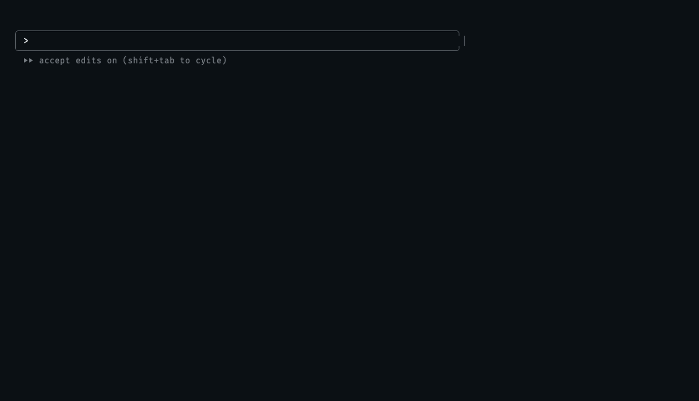

<div align="center">


# Compound Engineering

**Plan, build, review, improve.**

[](LICENSE)
[](docs/guides/README.md)

</div>

Compound Engineering gives coding agents 35 skills for planning features, building and debugging software, reviewing changes, and preserving lessons for future work. The workflow connects each change to the next: plans draw on earlier findings, and verified work can add knowledge the next agent will use.

This is the **Codex submission package**, refreshed from upstream `main` at [commit `9ac3272`](https://github.com/EveryInc/compound-engineering-plugin/commit/9ac32720f1c52b1fe4e760a79978647d53c9b429) on September 10, 2026. The upstream manifest still reports version **3.24.0**. See [package details](docs/submission.md) for the source revision, included files, and submission-specific changes.

Maintained by [Kieran Klaassen](https://github.com/kieranklaassen) and [Trevin Chow](https://github.com/tmchow), with contributions from the open-source community.

## Install

For marketplace installation, follow the upstream [Codex App instructions](https://github.com/EveryInc/compound-engineering-plugin#codex-app) or [Codex CLI instructions](https://github.com/EveryInc/compound-engineering-plugin#codex-cli). For an existing installation, see [upgrading](docs/install/upgrading.md).

This package contains the Codex manifest, skills, their reference files and helper scripts, documentation, and visual assets. Specialist reviewer and research prompts are included with the skills; they require no separate custom-agent installation. The upstream repository provides [installation options for other hosts](https://github.com/EveryInc/compound-engineering-plugin#more-install-options).

## Start in a project

Once the plugin is installed, open a project and run `$ce-setup`. It checks available tools and helps create or repair the project's Compound Engineering configuration. Optional dependencies depend on the workflows you use.

In Codex, invoke a skill with `$skill-name`. For example:

```text
$ce-brainstorm make background job retries safer
```

Work through the questions, then continue with:

```text
$ce-plan
$ce-work
$ce-simplify-code
$ce-code-review
$ce-compound
```

Each skill has a specific role:

| Skill | Result |
| --- | --- |
| [`$ce-brainstorm`](docs/guides/ce-brainstorm.md) | Requirements and unresolved decisions for a feature or change |
| [`$ce-plan`](docs/guides/ce-plan.md) | An implementation-ready plan grounded in the project |
| [`$ce-work`](docs/guides/ce-work.md) | Implemented work checked against the plan |
| [`$ce-simplify-code`](docs/guides/ce-simplify-code.md) | Clearer code with behavior preserved |
| [`$ce-code-review`](docs/guides/ce-code-review.md) | Findings on the change; applying fixes can be explicitly requested |
| [`$ce-compound`](docs/guides/ce-compound.md) | A durable learning when verified work revealed reasoning that the code, tests, and existing documentation do not already explain |

`$ce-compound` writes nothing when no learning meets that standard. When it does write a learning, future planning and review can use it.



This demo replays two real sessions 18 days apart, with identifying details replaced and the first run shortened. See the [demo notes](assets/demo/README.md) for its source and substitutions.

## Choose a starting point

| Need | Skill |
| --- | --- |
| Find something worth improving | [`$ce-ideate`](docs/guides/ce-ideate.md) |
| Understand existing behavior | [`$ce-explain`](docs/guides/ce-explain.md) |
| Get a recommendation on a supplied approach | [`$ce-pov`](docs/guides/ce-pov.md) |
| Develop and compare competing approaches | [`$ce-bakeoff`](docs/guides/ce-bakeoff.md) |
| Fix broken or slow behavior | [`$ce-debug`](docs/guides/ce-debug.md) |
| Rewrite, check, or draft prose | [`$ce-noslop`](docs/guides/ce-noslop.md) |

`ce-bakeoff` and `ce-noslop` are new in this snapshot compared with the previous submission. `ce-bakeoff` develops independent candidate approaches and compares them against a shared brief. `ce-noslop` improves clarity while preserving the source's facts and technical terms.

## Run the full pipeline

After settling requirements with `$ce-brainstorm`, invoke `$lfg` to plan, implement, simplify, review, test, and ship the change.

```text
$lfg
```

With a Git remote, `$lfg` can push changes, open a pull request, and watch CI with a bounded repair loop. It does not merge the pull request. Without a remote, it stops at local commits. It reports unresolved work when it reaches its repair limit. See the [`lfg` guide](docs/guides/lfg.md) for the full workflow.

## Skills at a glance

The [skill catalog](docs/guides/README.md) covers all 35 skills and links to a guide for each one.

| Group | Skills |
| --- | --- |
| [Core loop](docs/guides/README.md#the-core-loop) | `ce-brainstorm`, `ce-plan`, `ce-work`, `ce-simplify-code`, `ce-code-review`, `ce-compound` |
| [Around the loop](docs/guides/README.md#around-the-loop) | `ce-strategy`, `ce-product-pulse`, `ce-sweep`, `ce-compound-refresh` |
| [On demand](docs/guides/README.md#on-demand) | `ce-ideate`, `ce-bakeoff`, `ce-pov`, `ce-debug`, `ce-explain`, `ce-doc-review`, `ce-optimize`, `ce-prototype` |
| [Git workflow](docs/guides/README.md#git-workflow) | `ce-commit`, `ce-commit-push-pr`, `ce-babysit-pr`, `ce-resolve-pr-feedback`, `ce-worktree` |
| [Autonomous pipeline](docs/guides/README.md#autonomous-pipeline) | `lfg` |
| [Testing and design](docs/guides/README.md#testing-and-design) | `ce-test-browser`, `ce-test-xcode`, `ce-polish`, `ce-dogfood` |
| [Collaboration](docs/guides/README.md#collaboration) | `ce-proof`, `ce-handoff`, `ce-promote` |
| [Utilities](docs/guides/README.md#utilities) | `ce-setup`, `ce-noslop`, `ce-retune`, `ce-riffrec-feedback-analysis` |

## Configuration and tools

Project settings live in `.compound-engineering/config.yaml`. The default artifact locations include `docs/plans/` and `docs/solutions/`; set `docs_root` to place Compound Engineering artifacts under another directory in the project. See [configuration](docs/guides/configuration.md).

[Compound Packs](docs/guides/packs.md) let teams supply shared rules through local folders or Git repositories pinned to a revision. Planning uses those rules as context, and review checks changes against them. Packs are experimental.

Skills use the host's available tools and permissions. Some workflows need additional capabilities, such as browser control, GitHub access, a simulator, or an authenticated model CLI for independent review. `$ce-setup` reports what is available. Workflows can read or modify project files and use external services; [privacy and data handling](PRIVACY.md) explains where data may go.

## Documentation and support

- [Skill catalog](docs/guides/README.md)
- [Configuration](docs/guides/configuration.md) and [Compound Packs](docs/guides/packs.md)
- [Package details](docs/submission.md)
- [Concepts](CONCEPTS.md) and [upstream development](docs/development.md)
- [Release history](https://github.com/EveryInc/compound-engineering-plugin/releases)
- [Upstream contribution guide](https://github.com/EveryInc/compound-engineering-plugin/blob/main/CONTRIBUTING.md)
- [Report a bug](https://github.com/EveryInc/compound-engineering-plugin/issues) or [report a security issue privately](SECURITY.md)

## License

[MIT](LICENSE)
