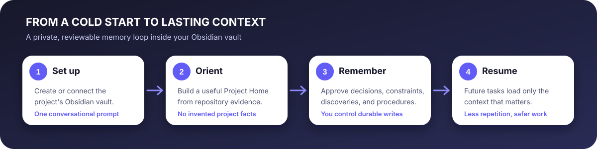

<p align="center">
  
</p>

# Stop explaining the same project to Codex

PMC gives Codex a memory it can use across tasks—stored as private, portable Markdown inside your project's Obsidian vault.

> **Set up lasting memory for this project in my Obsidian vault.**

That single prompt starts a guided setup, creates a useful Project Home, and offers to scan the repository for the context future work will need.



## Before and after

| Before PMC | After PMC |
|---|---|
| Every new task starts cold | Codex starts from a concise current state |
| Decisions live in old conversations | Rationale and evidence remain searchable |
| Nobody knows whether notes are current | PMC checks for drift and contradictions |
| Context is locked in a tool | Knowledge stays in Markdown you control |

## What PMC remembers

- Project purpose, structure, and important commands
- Accepted decisions and their rationale
- Non-negotiable constraints
- Verified discoveries and debugging lessons
- Reusable procedures
- Current status, risks, blockers, and next actions

## It fits normal conversation

```text
@PMC remember this
@PMC update the project status
@PMC what do we already know about deployment?
@PMC wrap up this task
@PMC check this project's memory
```

PMC can notice durable knowledge without interrupting every edit. Before promoting it, PMC tells you exactly what it wants to record and asks for approval.

## Local, private, and portable

PMC has no developer server, account, telemetry, analytics, or raw transcript capture. It uses Codex's normal local file permissions. Obsidian is the interface; ordinary Markdown is the durable format.

## Get started

- [Quickstart](quickstart.md)
- [Complete user guide](user-guide.md)
- [Daily workflow](daily-workflow.md)
- [Automatic orientation](automatic-orientation.md)
- [Privacy](privacy.md)
- [Troubleshooting](troubleshooting.md)
- [Support](support.md)
